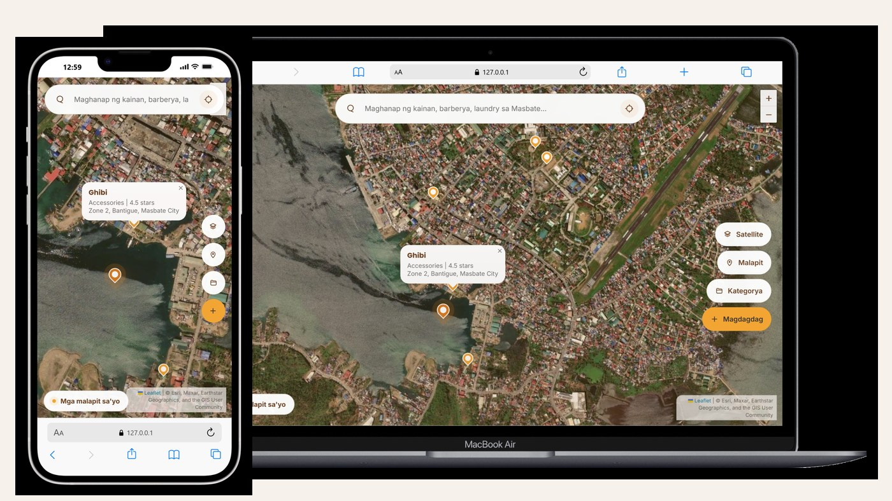
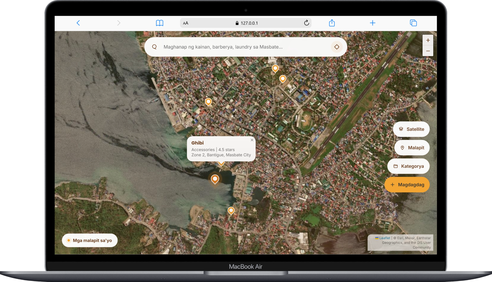
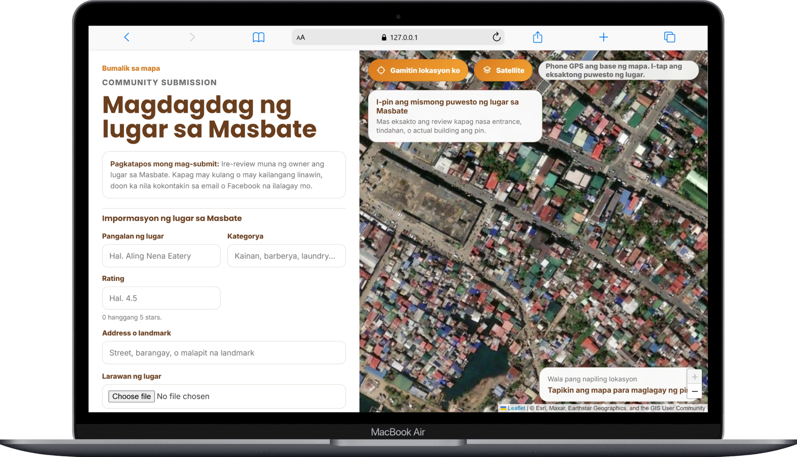
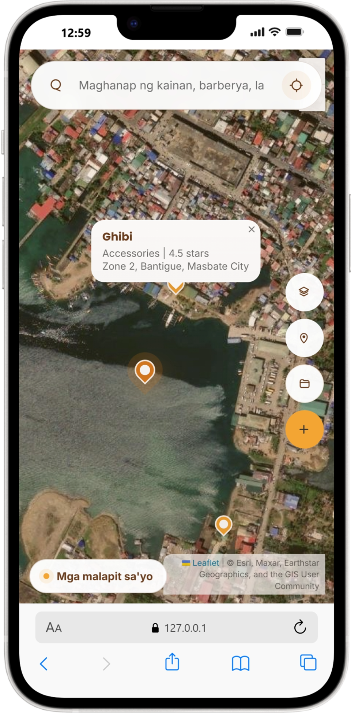
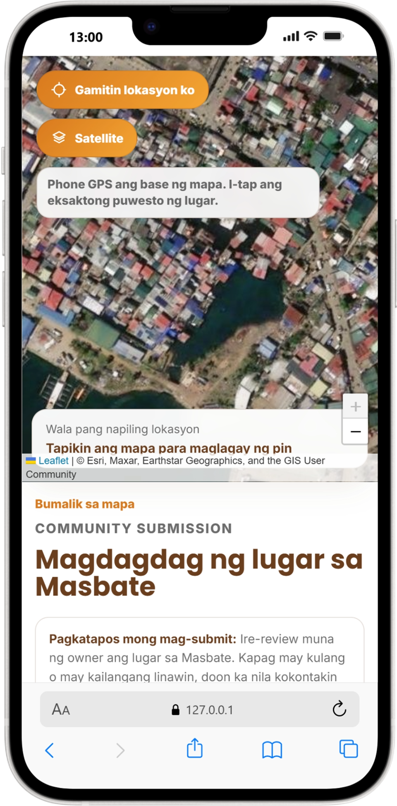

## Repository Notice

This project was originally developed and maintained in another GitHub account. It has been mirrored here as part of my professional portfolio to showcase my work and development experience.

# Didilang

Community-powered local discovery map for finding and submitting useful places in Masbate, Philippines.

## Project Overview

Didilang is a Django web application that helps residents, visitors, and local communities discover nearby places such as food spots, barbershops, laundry shops, stores, services, and landmarks in Masbate.

The project provides an interactive map experience where users can search for public places, view nearby results, open individual place pages, and submit new places for review. It is built as an MVP for local discovery, with a practical foundation for future business features such as verified business profiles, promoted listings, and local advertising.

The current codebase focuses on the discovery workflow, community submissions, owner/admin review, map-based search, media uploads, and local SEO preparation.

## Problem It Solves

Many small local businesses and useful community places are difficult to find online. People often rely on word of mouth, scattered social media posts, or manual searching to locate nearby services.

Didilang solves this by organizing local place information into a searchable map. It allows the community to contribute places while keeping public listings controlled through an admin review process.

## Key Features

- Interactive Leaflet map for local place discovery
- Satellite and default street map layer switching
- Nearby place search using location, radius, and result limit
- Text search by place name or category
- Public place detail pages with photo, category, rating, address, and coordinates
- Community place submission form with map pin selection
- Image upload with client-side image compression before submission
- Submission review workflow using `is_public` and `is_active` flags
- Django admin interface for managing places and submitters
- JSON endpoints for nearby and search results
- SEO-focused metadata, canonical URLs, Open Graph tags, Twitter cards, and JSON-LD structured data
- `robots.txt`, `sitemap.xml`, favicon route, and custom 404 page
- Automated tests for API behavior, submission validation, SEO pages, sitemap, robots file, and 404 handling

## Screenshots / Demo



| Map Discovery | Community Submission |
|---|---|
|  |  |
| Interactive map with search, nearby places, category controls, satellite layer, and place markers. | Community-powered place submission with exact map pin selection, category, address, rating, and photo upload. |

| Mobile Map Experience | Mobile Place Submission |
|---|---|
|  |  |
| Mobile-first map interface for nearby local discovery. | Responsive submission flow for adding useful places directly from a phone. |

## My Role

I designed and developed the project, including the Django backend, database models, form validation, map-based frontend integration, JSON API endpoints, media upload handling, SEO implementation, admin moderation workflow, and deployment-ready environment configuration.

## Tech Stack

| Area | Technology |
|---|---|
| Backend | Python, Django 6.0.4 |
| Frontend | Django Templates, HTML, CSS, Vanilla JavaScript |
| Mapping | Leaflet.js, OpenStreetMap tiles, Esri World Imagery tiles |
| Database | SQLite, Django ORM |
| Media Handling | Django `ImageField`, Pillow |
| Static Files | Django staticfiles, WhiteNoise |
| Testing | Django TestCase |
| Configuration | `.env` file loaded through Django settings |

## Skills Demonstrated

- Full-stack Django web development
- Database modeling with Django ORM
- Form validation and server-side data handling
- JSON API development
- Geolocation-based search logic
- Distance calculation using the Haversine formula
- Interactive map integration with Leaflet.js
- AJAX form submission and frontend state handling
- Image upload and browser-side image compression
- Admin-backed content moderation
- Static and media file configuration
- Local SEO implementation with structured data, sitemap, and robots file
- Environment-based configuration for safer deployment
- Automated testing for important user and SEO workflows

## System Workflow

User opens the Didilang map

-> Browser loads the default Masbate map center or requests the user's location

-> User searches by keyword or applies a nearby search radius

-> Frontend calls the Django JSON API

-> Backend filters public active places and calculates distance

-> Map markers and result cards are displayed

-> User can open a public place detail page or submit a new place

-> Submitted places are stored as non-public records

-> Admin reviews and publishes approved places

## Main Routes

| Route | Purpose |
|---|---|
| `/` | Interactive local discovery map |
| `/places/submit/` | Community place submission page |
| `/places/<id>-<slug>/` | Public SEO-friendly place detail page |
| `/api/places/nearby/` | Nearby place JSON endpoint |
| `/api/places/search/` | Search place JSON endpoint |
| `/robots.txt` | Search crawler rules |
| `/sitemap.xml` | XML sitemap for public pages |
| `/4/admin/` | Django admin panel |

## Project Structure

```text
didilang/
|-- base/
|   |-- admin.py          # Admin configuration for places and submitters
|   |-- api_views.py      # JSON endpoints for search and nearby places
|   |-- forms.py          # Place submission validation
|   |-- models.py         # Place and submitter database models
|   |-- page_views.py     # Public page views and submission handling
|   |-- seo_views.py      # robots.txt and sitemap.xml views
|   |-- tests.py          # Automated Django tests
|   |-- urls.py           # App-level routes
|   `-- utils.py          # Search, distance, slug, and serialization helpers
|-- didilang/
|   |-- settings.py       # Django settings and environment configuration
|   |-- urls.py           # Project routes
|   |-- asgi.py
|   `-- wsgi.py
|-- templates/
|   |-- 404.html
|   `-- public/           # Home, submit, detail, and SEO templates
|-- static/
|   |-- assets/           # Logo and favicon assets
|   |-- scripts/          # Map and submission JavaScript
|   `-- styles/           # Page-specific CSS files
|-- docs/                 # Product and SEO research notes
|-- media/                # Local uploaded media during development
|-- requirements.txt
|-- .env.example
`-- manage.py
```

## Installation and Setup

1. Clone the repository:

```bash
git clone https://github.com/astigPree/didilang.git
cd didilang
```

2. Create and activate a virtual environment:

```bash
python -m venv venv
```

Windows:

```bash
venv\Scripts\activate
```

macOS/Linux:

```bash
source venv/bin/activate
```

3. Install dependencies:

```bash
pip install -r requirements.txt
```

4. Create a local environment file:

```bash
copy .env.example .env
```

For macOS/Linux:

```bash
cp .env.example .env
```

5. Update `.env` with safe local values:

```env
SECRET_KEY=replace-with-a-local-development-secret
DEBUG=True
ALLOWED_HOSTS=127.0.0.1,localhost
CSRF_TRUSTED_ORIGINS=
```

6. Create and apply database migrations:

```bash
python manage.py makemigrations base
python manage.py migrate
```

7. Create an admin user:

```bash
python manage.py createsuperuser
```

8. Start the development server:

```bash
python manage.py runserver
```

9. Open the app:

```text
http://127.0.0.1:8000/
```

## Environment Variables

The project includes `.env.example`. Copy it to `.env` and update the values for your local or production environment.

| Variable | Purpose | Example |
|---|---|---|
| `SECRET_KEY` | Required Django secret key | `replace-with-a-secure-secret` |
| `DEBUG` | Enables or disables debug mode | `True` for local development |
| `ALLOWED_HOSTS` | Comma-separated allowed hosts | `127.0.0.1,localhost` |
| `CSRF_TRUSTED_ORIGINS` | Comma-separated trusted origins for HTTPS deployments | `https://example.com` |

Do not commit real secrets, production keys, or private configuration values.

## Usage

After running the project locally:

1. Open the homepage to view the interactive Masbate map.
2. Allow location access if you want nearby results based on your current position.
3. Search for places by name or category.
4. Adjust the radius and result limit to control nearby search results.
5. Open a place detail page to view its public information.
6. Submit a new place through `/places/submit/`.
7. Log in to `/4/admin/` to review submissions and publish approved places by setting `is_public` to `True`.

To run the test suite:

```bash
python manage.py test
```

## Future Improvements

- Add user accounts for business owners and community contributors
- Build a dedicated moderation dashboard instead of relying only on Django admin
- Add duplicate detection for submitted places
- Add category landing pages for stronger local SEO
- Add business profile verification
- Add promoted listings or sponsored placements as a monetization feature
- Move production data from SQLite to PostgreSQL
- Add PostGIS or geospatial indexing if the dataset grows significantly
- Add rate limiting and stronger anti-spam controls for submissions
- Add production deployment documentation with Gunicorn, Nginx, HTTPS, and backup strategy
- Add screenshots, demo video, and seeded sample data for portfolio presentation

## What I Learned

This project strengthened my ability to build a practical location-based web application with Django, Leaflet.js, server-side validation, JSON APIs, media uploads, SEO-focused pages, and admin moderation. It also reinforced the importance of building an MVP around a clear local problem before adding larger business features.

## Author

**Ericson Mark Abayon Guanzon**  
GitHub: https://github.com/astigPree  
Portfolio: https://programmerin.masbate.top  
Email: maxcrizguanzon123@gmail.com
"# didilang" 
